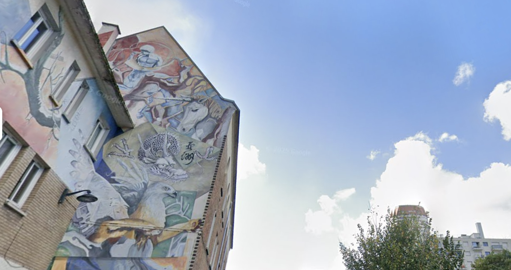

# R3GIRL in Paris (solved by: @MrSpavn)

## Category: Misc • Points: 200

## Description:
### *While enjoying her vacation, R3GIRL wanders into a neighborhood and gets lost. But wait, she spots something familiar ...*

### *Can you identify the name of the building and the artist(s) who created the graffiti seen in the photo?*

### *Flag format R3CTF{Place-Name-FirstnameN}*

### *Note: Please use the building's original name, and preserve the original casing (uppercase/lowercase). Remove any accents from letters, and use hyphens to separate words. List only the first names of the artist(s), in the order they appear or are best known.*

### *If the place is Montmartre Museum (Musée de Montmartre), and the three artists' first names are Alice, Bob, and Carol, then the flag is R3CTF{Musee-de-Montmartre-Alice-Bob-Carol}*

---
## Challenge Overview

We have picture of house with graffiti and we should find house name and graffiti authors

## OSINT

After some easy researches i founded these links:

https://www.tripadvisor.ru/LocationPhotoDirectLink-g187147-d16881390-i385293348-Fresque_De_tous_pays_viendront_tes_enfants-Paris_Ile_de_France.html

https://www.google.ru/maps/place/Our+Lady+of+China/@48.8215919,2.3632008,21z/data=!4m6!3m5!1s0x47e671875ca42a17:0x884b3543ebf1107d!8m2!3d48.8216913!4d2.3632229!16s%2Fg%2F121vl6sd?hl=ru&entry=ttu&g_ep=EgoyMDI1MDYzMC4wIKXMDSoASAFQAw%3D%3D

so we can compare all data from them and get flag

## Results

R3CTF{Eglise-Notre-Dame-de-Chine-Cyril-David}
