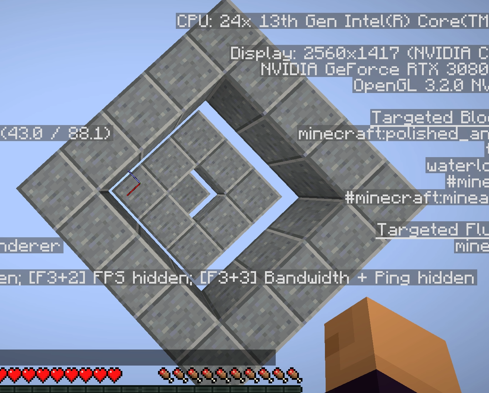
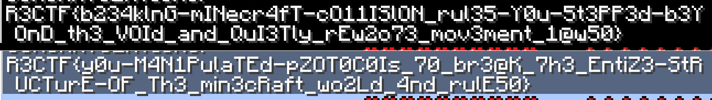

# r3craft and r4craft (solved by: @MrSpavn)

## Category: Misc • Points: 680 (r3craft) + 1000 (r4craft)


## Description for r3craft:
### *Here, r3girl awakes in a narrow yard, surrounded by cold stone walls and silent watchers bound to r3kapig's will, punishing anything that dares to defy physics. The walls aren’t impossibly tall, but just high enough to stop a normal jump. They say escape lies not in brute force, but in stepping that bends the rules ever so slightly.*

## Description for r4craft:
### *WEE-OO WEE-OO WEE-OO! Subject has escaped!*
### *The silent watchers stood powerless as r3girl’s forbidden step twisted movement and collision, carrying her beyond the cold stone walls. For a fleeting moment, she walked free — proof that the rules could be bent.*

### *But the alarm reached r3kapig’s high architects. At once, they moved to rewrite the very fabric of this narrow yard, sealing each loophole, tightening the laws she had dared to defy.*

### *r3girl ran fast into the void beyond — but before freedom could truly take shape, a silent shot from above turned her vision to darkness. Now, under the steady pulse of red lights and the watchers’ unblinking gaze, she awakes once more, trapped here again...*
---
## Challenge Overview

We have a Minecraft server with GrimAC anti-cheat and a custom plugin for getting the flag.
The essence of the task is to jump 2 blocks high and not be excluded by GrimAC, The map itself looks like this: [MAP]



## Plugin analysis

### Plugin code
```java
package com.r3kapig.r3craft;

import ac.grim.grimac.api.GrimAbstractAPI;
import ac.grim.grimac.api.event.events.FlagEvent;
import ac.grim.grimac.api.plugin.BasicGrimPlugin;
import ac.grim.grimac.api.plugin.GrimPlugin;
import java.util.Collection;
import java.util.HashMap;
import java.util.Map;
import java.util.UUID;
import net.kyori.adventure.text.Component;
import net.kyori.adventure.text.TextComponent;
import org.bukkit.GameRule;
import org.bukkit.Material;
import org.bukkit.World;
import org.bukkit.command.Command;
import org.bukkit.command.CommandExecutor;
import org.bukkit.command.CommandSender;
import org.bukkit.entity.Player;
import org.bukkit.event.EventHandler;
import org.bukkit.event.Listener;
import org.bukkit.event.player.PlayerJoinEvent;
import org.bukkit.event.player.PlayerQuitEvent;
import org.bukkit.event.server.ServerLoadEvent;
import org.bukkit.plugin.Plugin;
import org.bukkit.plugin.RegisteredServiceProvider;
import org.bukkit.plugin.java.JavaPlugin;

public class R3Craft
extends JavaPlugin
implements Listener {
    private final Object flagEventlock = new Object();
    private final Map<UUID, Integer> playerViolationCount = new HashMap<UUID, Integer>();
    private final Map<UUID, Boolean> hasPlayerBeenKicked = new HashMap<UUID, Boolean>();
    private final Map<UUID, Boolean> playerLoginLocationValid = new HashMap<UUID, Boolean>();
    private long lastPlayerQuitTime = 0L;
    private final int Y_PLATFORM = -60;
    private final int Y_BORDER = -59;
    private final int Z_SPAWN = 0;
    private final int X_SPAWN = 0;

    public void onEnable() {
        this.saveDefaultConfig();
        if (this.getServer().getPluginManager().getPlugin("GrimAC") == null) {
            this.getLogger().severe("GrimAC not found!");
            this.getServer().shutdown();
            return;
        }
        RegisteredServiceProvider provider = this.getServer().getServicesManager().getRegistration(GrimAbstractAPI.class);
        if (provider == null) {
            this.getLogger().severe("GrimAC API not found!");
            this.getServer().shutdown();
            return;
        }
        this.getServer().getPluginManager().registerEvents((Listener)this, (Plugin)this);
        this.getCommand("flag").setExecutor((CommandExecutor)this);
        BasicGrimPlugin plugin = new BasicGrimPlugin(this.getLogger(), this.getDataFolder(), this.getPluginMeta().getVersion(), this.getPluginMeta().getDescription(), (Collection)this.getPluginMeta().getAuthors());
        GrimAbstractAPI api = (GrimAbstractAPI)provider.getProvider();
        api.getEventBus().subscribe((GrimPlugin)plugin, FlagEvent.class, event -> {
            Object object = this.flagEventlock;
            synchronized (object) {
                Boolean hasBeenKicked;
                UUID playerId = event.getPlayer().getUniqueId();
                Integer newViolationCount = this.playerViolationCount.put(playerId, this.playerViolationCount.getOrDefault(playerId, 0) + 1);
                if (newViolationCount != null && newViolationCount > this.getConfig().getInt("kick-violation-threshold", 5) && ((hasBeenKicked = this.hasPlayerBeenKicked.getOrDefault(playerId, false)) == null || hasBeenKicked.equals(Boolean.FALSE))) {
                    this.hasPlayerBeenKicked.put(playerId, true);
                    this.getServer().getScheduler().runTask((Plugin)this, () -> {
                        Player player = this.getServer().getPlayer(playerId);
                        if (player != null) {
                            player.kick((Component)Component.text((String)"You have been kicked for excessive violations."));
                        }
                    });
                }
            }
        });
    }

    @EventHandler
    public void onServerLoad(ServerLoadEvent event) {
        int z;
        World world = this.getServer().getWorld("world");
        if (world == null) {
            this.getLogger().warning("world not found!");
            this.getServer().shutdown();
            return;
        }
        world.setSpawnLocation(0, -60, 0);
        world.setGameRule(GameRule.SPAWN_RADIUS, (Object)0);
        world.setGameRule(GameRule.DO_DAYLIGHT_CYCLE, (Object)false);
        world.setTime(6000L);
        for (int x = -1; x <= 1; ++x) {
            for (z = -1; z <= 1; ++z) {
                if (x == 0 && z == 0) {
                    world.getBlockAt(x, -61, z).setType(Material.POLISHED_ANDESITE_SLAB);
                    continue;
                }
                world.getBlockAt(x, -60, z).setType(Material.POLISHED_ANDESITE_SLAB);
            }
        }
        Material borderMat = Material.POLISHED_ANDESITE;
        for (int x = -2; x <= 2; ++x) {
            world.getBlockAt(x, -59, -2).setType(borderMat);
            world.getBlockAt(x, -59, 2).setType(borderMat);
        }
        for (z = -1; z <= 1; ++z) {
            world.getBlockAt(-2, -59, z).setType(borderMat);
            world.getBlockAt(2, -59, z).setType(borderMat);
        }
    }

    @EventHandler
    public void onPlayerJoin(PlayerJoinEvent event) {
        Player player = event.getPlayer();
        if (this.lastPlayerQuitTime > 0L && System.currentTimeMillis() - this.lastPlayerQuitTime < 1000L) {
            player.kick((Component)Component.text((String)"Please wait a moment before rejoining."));
            return;
        }
        boolean valid = player.getLocation().getBlockY() <= -60;
        this.playerLoginLocationValid.put(player.getUniqueId(), valid);
    }

    @EventHandler
    public void onPlayerQuit(PlayerQuitEvent event) {
        UUID playerId = event.getPlayer().getUniqueId();
        this.playerLoginLocationValid.remove(playerId);
        this.playerViolationCount.remove(playerId);
        this.hasPlayerBeenKicked.remove(playerId);
        this.lastPlayerQuitTime = System.currentTimeMillis();
    }

    public boolean onCommand(CommandSender sender, Command command, String label, String[] args) {
        if (!(sender instanceof Player)) {
            return true;
        }
        Player player = (Player)sender;
        Runnable task = () -> player.sendMessage((Component)Component.text((String)"NO FLAG FOR YOU!"));
        if (player.isOnline() && !this.hasPlayerBeenKicked.getOrDefault(player.getUniqueId(), false).booleanValue() && this.playerLoginLocationValid.getOrDefault(player.getUniqueId(), false).booleanValue() && player.getLocation().getY() >= -56.7748) {
            task = () -> {
                if (player.isOnline() && !this.hasPlayerBeenKicked.getOrDefault(player.getUniqueId(), false).booleanValue()) {
                    if (this.playerLoginLocationValid.getOrDefault(player.getUniqueId(), false).booleanValue() && player.getLocation().getBlockY() > -59) {
                        Component message = ((TextComponent)Component.text((String)"CONGRATULATIONS!").appendNewline()).append((Component)Component.text((String)this.getConfig().getString("flag")));
                        player.sendMessage(message);
                    } else {
                        player.sendMessage((Component)Component.text((String)"NO FLAG FOR YOU!"));
                    }
                }
            };
        }
        this.getServer().getScheduler().runTaskLater((Plugin)this, task, 10L);
        return true;
    }
}
```

In the plugin we can see the mandatory conditions for receiving the flag, namely:
- the position when entering the server must be <= -60
- when sending /flag to the chat, you must be at an altitude of at least -56.7748
- 10 ticks after sending, the player must be at an altitude of at least -59

only after all these conditions are met will the flag appear in the chat

We can also notice that between these tasks only the GrimAC config file changes:

r3craft:
```yml
Simulation:
    immediate-setback-threshold: 0.5001
    max-advantage: 0.5001
```

r4craft:
```yml
Simulation:
    immediate-setback-threshold: 0.25
    max-advantage: 0.25
```

but our solution fits both options)

## Attack Strategy

1. **Write a mod for minecraft that when pressing a bind teleports the player slightly upwards (so as not to trigger GrimAC)**

2. **Install the mod and join the server**

3. **During the jump, it is better to press the bind in mid-air, after which we will realize that we have jumped 2 blocks high**

4. **jump from the highest blocks and write in the chat "/flag"**

5. **Get a flag in the chat and start dancing**

## Solution Code

```java
package com.example;

import net.fabricmc.api.ClientModInitializer;
import net.fabricmc.fabric.api.client.event.lifecycle.v1.ClientTickEvents;
import net.fabricmc.fabric.api.client.keybinding.v1.KeyBindingHelper;
import net.minecraft.client.option.KeyBinding;
import net.minecraft.client.MinecraftClient;
import net.minecraft.text.Text;
import net.minecraft.util.math.Vec3d;
import org.lwjgl.glfw.GLFW;

public class ExampleModClient implements ClientModInitializer {
	private static KeyBinding teleportKey;
    private static boolean wasPressed = false;

	@Override
	public void onInitializeClient() {
		teleportKey = KeyBindingHelper.registerKeyBinding(new KeyBinding(
			"key.teleportmod.teleport",
			GLFW.GLFW_KEY_Z,
			"category.teleportmod.main"
		));

		ClientTickEvents.END_CLIENT_TICK.register(client -> {
			if (teleportKey.isPressed() && !wasPressed) {
				wasPressed = true;
				teleportUp();
			} else if (!teleportKey.isPressed()) {
				wasPressed = false;
			}
		});
	}

	private void teleportUp() {
        MinecraftClient client = MinecraftClient.getInstance();
        if (client.player == null) return;

        Vec3d currentPos = client.player.getPos();
        Vec3d newPos = currentPos.add(0, 0.3, 0);
        
        client.player.setPosition(newPos);
            
        client.player.networkHandler.sendChatCommand("flag");
    }
}
```

## Results


